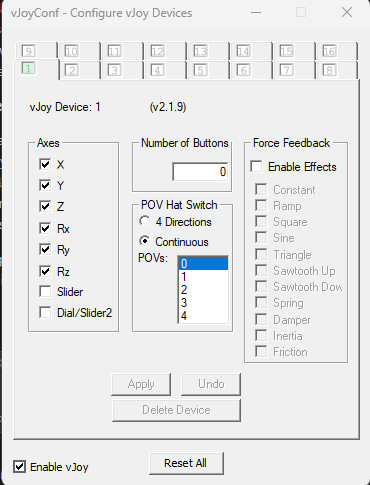

# vJoy Serial

This repo is a parser utilizing [vJoy](https://github.com/jshafer817/vJoy) and [wireless-rc-adapter](https://github.com/wireless-rc-adapter/wireless-rc-adapter) in combination to use an Arduino Nano as RC-Receiver on a computer.

For what? For using a cheap CH340 or equal USB-to-Serial converter to control a computer with an existing PWM or PPM RC-Receiver. The [wireless-rc-adapter](https://github.com/wireless-rc-adapter/wireless-rc-adapter) project requires an Arduino Leonardo or equal.

## Instructions

### Prerequisites
- .NET SDK 8.0 or later
- Arduino Nano, Uno or equal flashed with [wireless-rc-adapter](https://github.com/wireless-rc-adapter/wireless-rc-adapter), configured & wired correctly and connected to the computer via USB
- Correct drivers installed for the Arduino board
- [vJoy](https://github.com/jshafer817/vJoy) setup and prepared

### Build
Build the project using:
`dotnet build src/serial-joystick.sln`

Publish the executable (x64, windows) using:
`dotnet publish src/serial-joystick.sln`

### Run
Run the published executable from the `bin\Release\net8.0\win-x64\publish` directory.

## Configuration

### Application
Configure the appsettings.json according to your needs.

Following Parameters are available:
- `JoystickId`: The ID of the vJoy joystick to use for input, default device 1
- `SerialPort`: The serial port to use for communication with the Arduino, Example COM8
- `BaudRate`: The baud rate of the serial port, default 9600

### vJoy


### Arduino / wireless adapter config

<details>
<summary>Wireless adapter configuration</summary>

```CPP
    /* Wireless RC Adapter v2.1
    *  http://wireless-rc-adapter.github.io
    * 
    * Connects an RC receiver as a HID compatible
    * joystick to almost any kind of device, with
    * just a simple USB cable.
    * 
    *  GregNau    2015-2019
    */


    // Configuration options
    //  (Wiki: http://github.com/wireless-rc-adapter/wireless-rc-adapter/wiki)

    // >>> Input signal modulation (uncomment only one!) <<<
    #define PWM_RECEIVER  // Enable Pulse Width Modulation receiver
    //#define PPM_RECEIVER  // Enable Pulse Position Modulation receiver

    //#define CHANNELS 8  // Override the default 6 channels (PPM max: 8, PWM max: 6)

    // >>> Serial-Debug options for troubleshooting <<<
    //#define SERIAL_DEBUG  // Enable Serial Debug by uncommenting this line
    //#define SERIAL_SPD 115200  // Set debug bitrate between 9600-115200 bps (default: 9600)

    // >>> Calibration settings <<<
    // #define CAL_CHANNEL 3  // Set which channel can trigger calibration on boot (default: 3 or 1)
    //#define CAL_TIMEOUT 7000  // Custom delay in milliseconds to auto-accept calibration data (default: 5000)
    #define CAL_DISABLE  // Uncommenting this line causes the calibration to be disabled *
    // (* when calibration disabled, do not forget to set stick center and halfway below!)

    // >>> Joystick settings <<<
    //#define STICK_CENTER 1500  // Configure custom stick center value (disables calibration! | default: 1500)
    //#define STICK_HALFWAY 500  // Define custom halfway value (disables calibration! | default: 500)
    //#define THRESHOLD 100  // Customize channel value detection threshold (disables calibration! | default: 100)
    //#define BTN0_KEY_LOW 'u'  // Assign keyboard key to send when Button-0 is in LOW position
    //#define BTN0_KEY_HIGH 'i'  // Assign keyboard key to send whe Button-0 is in HIGH position
    //#define BTN1_KEY_LOW 'c'  // Assign keyboard key to send when Button-1 is in LOW position
    //#define BTN1_KEY_HIGH 'c'  // Assign keyboard key to send when Button-1 is in HIGH position
    
    // >>> Fixes, workarounds, etc <<<
    //#define FUTABA  // Futaba PPM fix (disables calibration!)
    //#define COMPAT_FIX  // In case of joystick issues, try to enable this option. (eg. Aerofly sim)

    // End of Configuration options
```
</details>